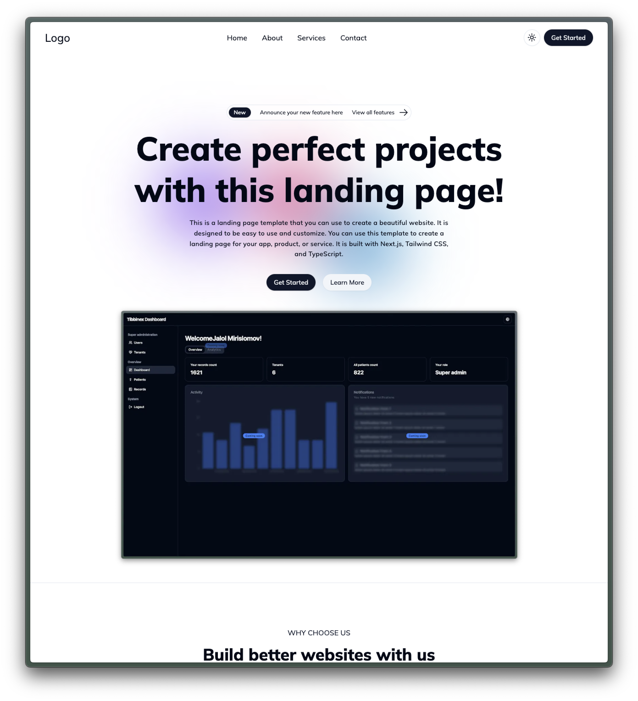
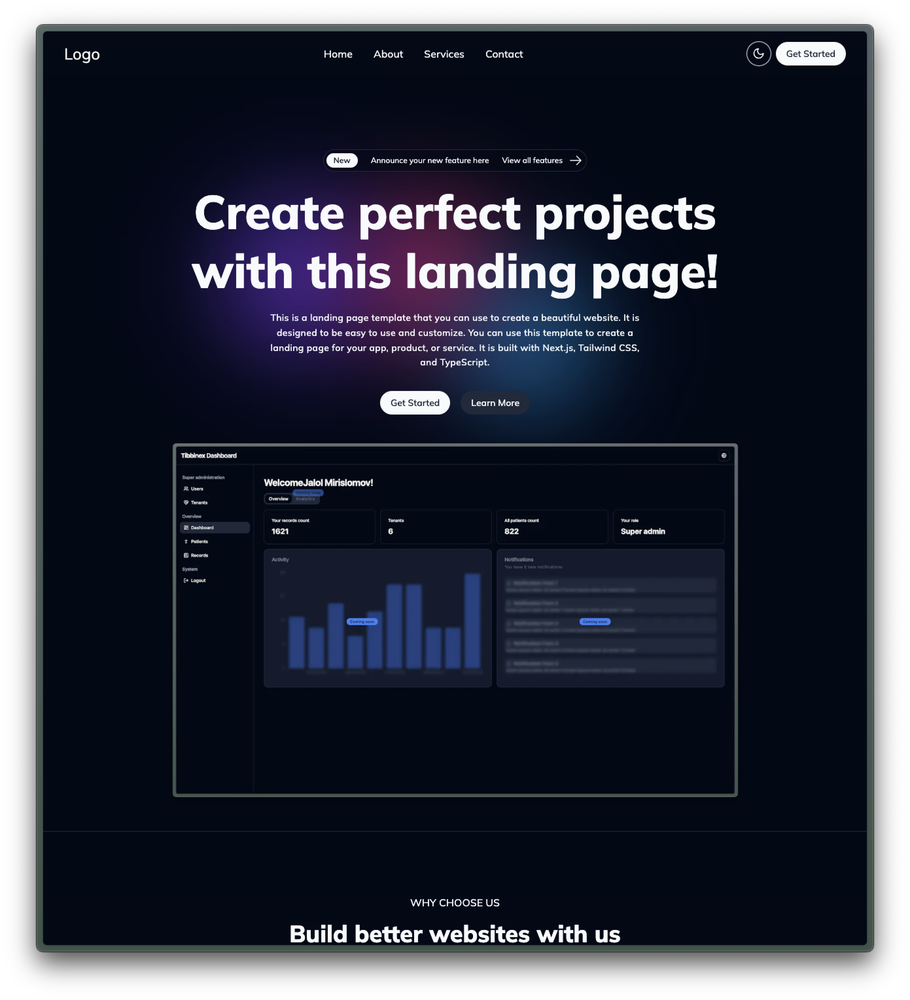

# Open Source SAAS Landing Page Template

This is an open source Software as a Service (SAAS) landing page template built with [Next.js](https://nextjs.org/), [TypeScript](https://www.typescriptlang.org/), and [React](https://reactjs.org/). It's designed to be easy to use and customize to help you create a beautiful, professional landing page for your app, product, or service.

## Preview

<div>
  
   
</div>

## Features

- Fully responsive design
- Built with Next.js, TypeScript, and React
- Easy to customize
- High performance

## Getting Started

Installation locally:

```bash
npm run dev
# or
yarn dev
# or
pnpm dev
# or
bun dev
```
